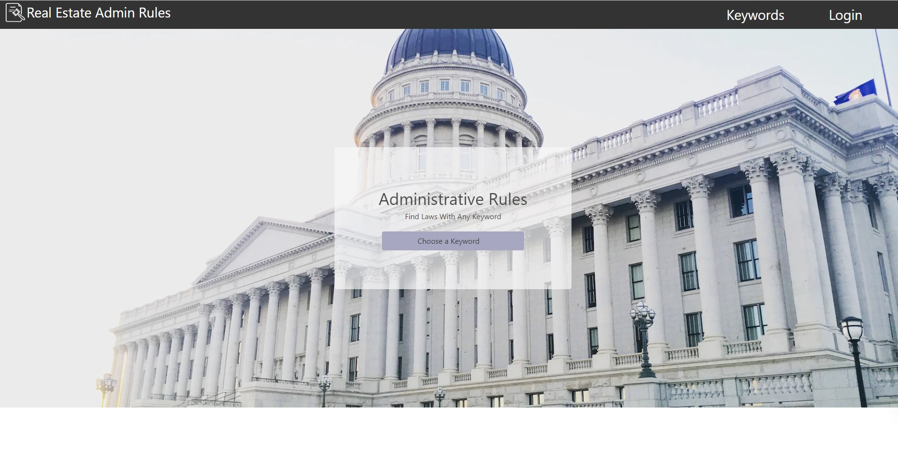
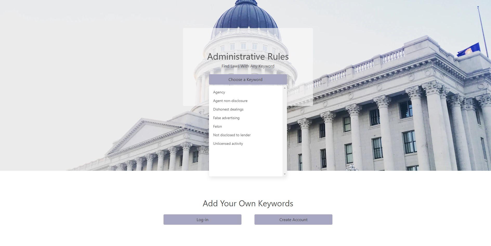
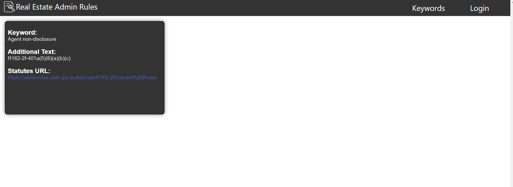
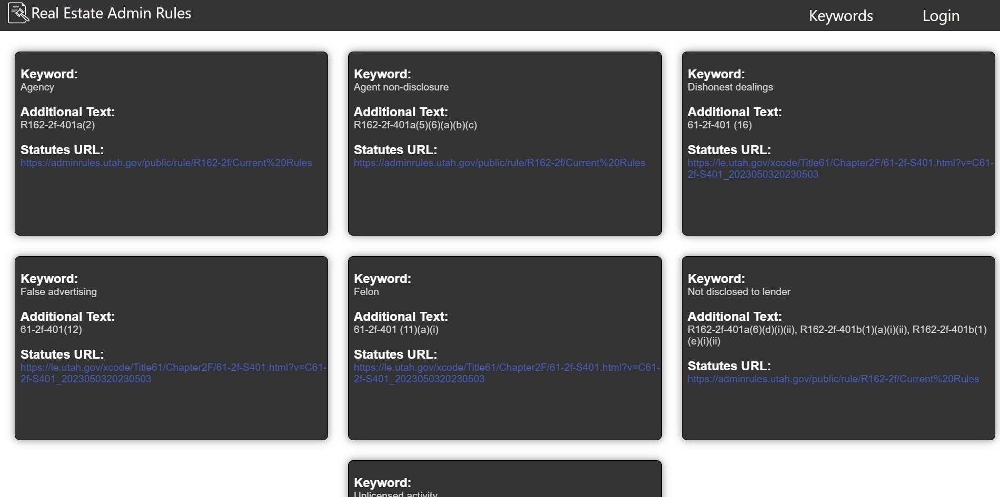
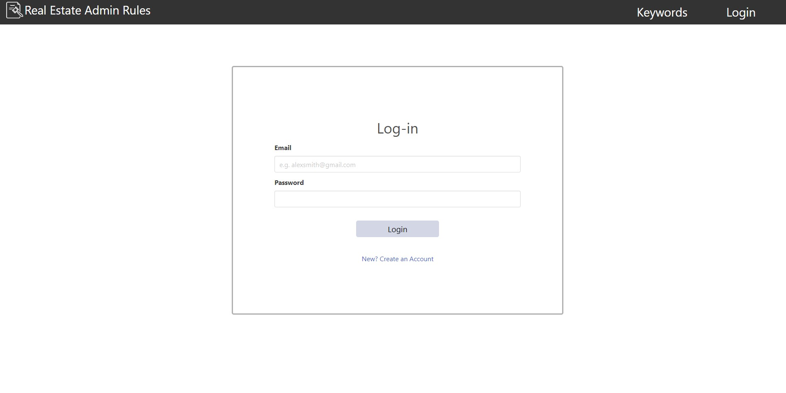
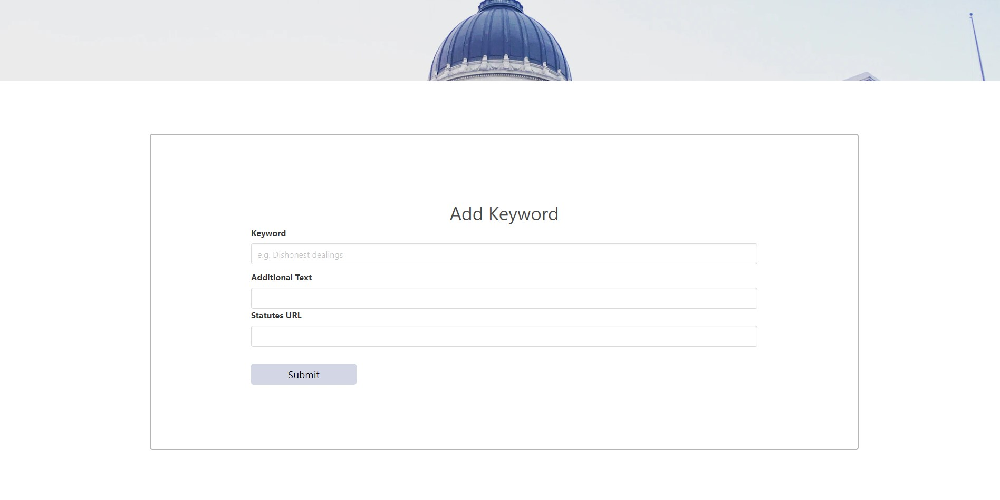

# Real Estate Administrative Rules. 
   
 
 ## Table of Contents
-[Description](#description)  
-[Installation](#installation)  
-[Usage](#usage)  
-[Credits](#credits)  
-[License](#license)  
-[Badges](#badges)  
-[Features](#features)  
-[How to contribute](#contribute)  
-[Tests](#tests)  

 ## Description
 
 As a Real Estate Investigator for the State of Utah, I need to look up and cite laws in my reports. The current website is a .pdf embedded into the website.  This makes it so we are unable to quickly pull up the law as needed, and have to spend a significant amount of time searching for the correct law.
 This project provides a way for us to look up a law or group of corresponding laws by a keyword, and lets an approved user add keywords with the corresponding law(s). This project is meant to be self building with the user adding to the keyword database.

 This will save anyone in the Real Estate industry that needs to look up a law regarding a certain subject a lot of time. It will also help to group laws together based on the key word, so that more than one law can be cited and read quickly. 

 During the creation of the Database, we learned that the laws are not necessarily written to be coded easily. I spoke with the Lawyer that writes the Real Estate laws once they have been approved and he informed me, that there are rules to how the laws have to be structured. The way the Laws are written and have to remain was definetly a challenge. Creative ways to have it do what we want and to bring up the seeded information was not easy.

 This project is functional and since I work for the Division of Real Estate, I have mentioned using my project for our office and have pending approval to do so from both my direct supervisor and the Division Director. It is up to us to make it good enough for the Real Estate portion of the Division website and investigator use. Everyone in the office is excited to see what we can come up with to save them time.

 In the future we would like to add a place where the user could read the law in it's entirety if they want. We also want to add an edit feature, so we could edit the keyword and the law as the laws can change, or someone may miss an applicable law to a keyword and want to add it.  Also to avoid having to use a very long drop down for all the keywords, we want to add a section heading dropdown to narrow down which keywords will show up for that section.  Also if you already know the keyword, then you can search with an input search as well or just start typing it and it will start propogating words that it could be.  We also thought a little copy feature once the law is pulled up would be very useful, so we could just copy the location and paste it into our reports.      

## Installation

 Github repo:  https://github.com/Jelu113/RE-law-lookup.git

 Deployed with Railway:  https://re-law-lookup-production-6926.up.railway.app/

## Usage
Here you can see our Home Page, it contains a Home link in the header on the left, a Keywords and Login page in the header on the right. It has an Adminstrative Rules keyword drop down. 

   

The dropdown shows the keywords you can choose from.  Once a keyword is chosen, you will be directed to the next page.  This picture also shows the bottom of the homepage that holds a log-in or create account buttons.  

   

Once you click on the keyword, a new page shows the location of the Law regarding the keyword, as well as a link to the current website where you can read the law to ensure you are using the right law. 

If you choose the Keyword link in the header it will take you to all the keywords currently in the database.

When you click on the any of the login buttons throughout the website you will see this screen. 

Once logged in, you will be able to create your own key word and add it to the database, along with which laws correspond with that key word and the URL to find the complete law. 

   

Your keyword will then be added to both the Keyword page and the dropdown menu for you or others to use in the future. 

## Credits
 Collaborators on this project are:

 Nathan Greef https://github.com/NateGreeff, 

 Max Berhmann https://github.com/mbman11, 

 Jon Bay https://github.com/JonBay and

 Jenae Luthi https://github.com/Jelu113. 

## License
None
## Features
This websites features a drop down menu of keywords, the ability to bundle laws together by keyword to find again faster the next time, to add to Real Estate investigative reports.   

## How to contribute
To contribute to this project please contact one of the 4 collaborators listed above. 

